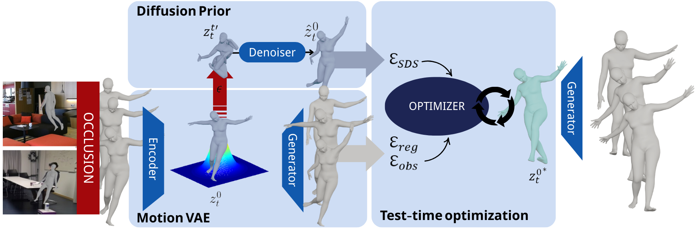

# DREAMoR: Diffusion-based REconstruction And Motion prioR

Monocular human motion capture systems often suffer from noisy or incomplete predictions due to occlusions, poor visibility, or ambiguous poses. To address these limitations, we propose **DREAMoR**: a diffusion-based motion prior framework for reconstructing physically plausible human motion from corrupted sequences. Our method first learns a latent space of motion transitions using a MotionVAE trained on clean data. We then train a diffusion model in this latent space to capture the distribution of realistic motion transitions, conditioned on previous frames. At inference time, we use multistep DDIM-style denoising and score distillation to optimize the latent sequence, ensuring that the resulting motion both aligns with the noisy input and adheres to the learned motion prior. Experiments on AMASS show that DREAMoR outperforms prior methods in recovering occluded joints and produces smoother, more realistic motion. Our ablation studies further highlight the effectiveness of latent diffusion priors for motion refinement.



## Key Features

DREAMoR supports three main functionalities:

1. **Training the Diffusion-based Motion Prior**: Learn a realistic motion prior using a latent diffusion model
2. **Fitting on AMASS Datasets**: Apply DREAMoR to recover plausible human motion from corrupted sequences
3. **Comprehensive Evaluation**: Both qualitative visualization and quantitative metrics to assess reconstruction quality


## Files to download
- [Datasets](https://drive.google.com/drive/folders/1If5GDVV0UunvTh3mo8gXnJoDk4fsIS7F?usp=drive_link)
- [Body_models](https://drive.google.com/drive/folders/1XhbNDX4Q0s5V2172lgB8_Pptnk97DkJS?usp=drive_link)
- [Pretrained models](https://drive.google.com/drive/folders/1zypbpd0FOMT3VTgSukiZuZ6al_UKZSsw?usp=sharing)
- [Checkpoints](https://drive.google.com/drive/folders/1I5kxIPxIFmonpYWxGsAQAuz3_CmpsVrq?usp=sharing)

## 1. Training with Google Colab

### 1.1 Prepare Your Data (First-Time Setup)

Before training, get dataset and bodymodels and pretrained motionVAE:

- [Datasets](https://drive.google.com/drive/folders/1If5GDVV0UunvTh3mo8gXnJoDk4fsIS7F?usp=drive_link)
- [Body_models](https://drive.google.com/drive/folders/1XhbNDX4Q0s5V2172lgB8_Pptnk97DkJS?usp=drive_link)
- [Pretrained models](https://drive.google.com/drive/folders/1zypbpd0FOMT3VTgSukiZuZ6al_UKZSsw?usp=sharing)

Your directory structure should look like this:

```
My Drive/
└── DREAMoR/
    ├── body_models/      # body models SMPLH and VPoser
    ├── datasets/         # Datasets
    ├── out/              # Output directory (for checkpoints, logs, etc.)
    └── pretrained_models/ # Pretrained MotionVAE
```

> `body_models`, `pretrained_models/` and `datasets/` folders are shared folders.

### 1.2 Open the Notebook (via GitHub Import)

1. Go to [Google Colab](https://colab.research.google.com/)
2. Click the **GitHub** tab
3. Search for our humor repo
4. Select the repository and the correct **branch**
5. Open the notebook: train.ipynb

### 1.3 Start Training

1. In the opened notebook, uncomment the first three cells
2. Run those cells to install all dependencies
3. After installation, Colab may prompt you to **Restart Runtime** — accept then
4. Choose a training config from the configs directory (e.g. `configs/colab_trian_motion_vae.yaml` or `configs/colab_train_diffusion_transformer.yaml`)
5. Then, run the rest of the notebook to begin training

### 1.4 Tips

- Output checkpoints and logs are saved in: `My Drive/DREAMoR/out/`
- To modify more config settings, refer to config_new.py

## 2. Training Locally

To train DREAMoR locally:

1. Install the required dependencies
2. Modify the configuration files in the configs directory to match your local paths
3. Run the training notebook: `train.ipynb`

Make sure to adjust the paths both in config file and notebook for:
- Dataset location
- Body model files
- Pretrained MotionVAE
- Output directories

The training process is identical to the Colab version, but leverages your local hardware.

## 3. Running DREAMoR Fitting

To run motion reconstruction on corrupted sequences:

1. Download the required pretrained models:
   - DREAMoR diffusion model
   - MotionVAE encoder/decoder
   - Body models (SMPL+H and VPoser)

2. Configure the fitting parameters in the fitting config file:
   - Input data paths
   - Corruption settings
   - Optimization parameters

3. Run the fitting process: `fit.ipynb`

The fitting process uses the pretrained DREAMoR model to optimize corrupted motion sequences, producing physically plausible reconstructions.

## 4. Evaluation

Get result `npz` files after fitting, then you can calculate the evaluation metrics and visualize the results.

### 4.1 Visualization

To visualize the optimization results:

```
python dreamor/fitting/eval_fitting_3d.py --results ./out/your_experiment_name/results_out --out ./out/your_experiment_name/eval_out --qual --viz-observation
```

### 4.2 Quantitative Evaluation

To compute evaluation metrics:

```
python dreamor/fitting/eval_fitting_3d.py --results ./out/your_experiment_name/results_out --out ./out/your_experiment_name/eval_out --quant
```

The most relevant quantitative results will be written to `eval_out/eval_quant/compare_mean.csv`.

---

## 5. Acknowledgements
This code is based on the:
- [HuMoR](https://github.com/davrempe/humor)

Thanks to the authors for their work and for making their code available!!